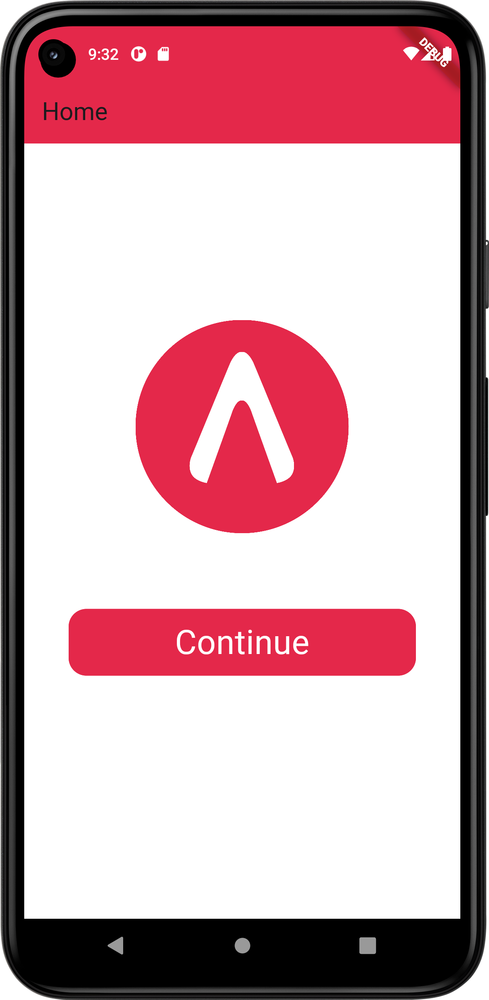

# Mobile Developer Test Accurate
 Mobile Apps Developer Test - Henry Cangrandhi

 # Cara penggunaan aplikasi
 Aplikasi ini dibuat seefisien dan semudah mungkin agar user dapat dengan mudah mempelajari dan menggunakan aplikasi ini.
 - Aplikasi ini terdiri dari 2 screen yaitu home screen dan user list.
 - Saat pertama kali masuk, user akan berada di home screen yang terdiri dari logo accurate dan tombol "Continue".
 - User dapat melanjutkan dengan menekan tombol "Continue" pada layar dan akan dinavigasi ke halaman user list oleh sistem.
 - Setelah itu, user akan melihat beberapa komponen dalam halaman user list seperti search box, filter button, sort by name text, dan card berisi data user yang diambil dari API.
 - User dapat melakukan input pada search box dan sistem akan mencari nama user pada card yang sesuai dengan input dan menghilangkan card yang namanya tidak sesuai.
 - User juga dapat menekan tombol filter dan sistem akan memanggil bottom sheet. Pada bottom sheet tersebut, user dapat melakukan sort by city. Sistem akan mengelompokan setiap card yang memiliki value city yang sama.
 - User dapat menekan text "sort by name" untuk melakukan sort secara alphabet/ascending. Lalu, user juga dapat menekan tombol sort lagi untuk mengembalikan ke keadaan awal.

 # Teknologi yang digunakan
 - Aplikasi ini dibuat menggunakan library: Bloc (8.1.3), flutter_bloc (8.1.4), http (0.13.6), get (4.6.6)

 # User Interface
   - Tampilan Home screen dibuat seperti tampilan aplikasi pada umumnya yang memiliki logo dan juga tombol untuk melanjutkan ke halaman user list.
   
   - Setelah itu, halaman user list terdiri dari search box dan filter button diatas/diawal agar user dapat langsung mencari nama atau apply filter.
   - Sory by name diletakan sebelum tampilan card agar mempermudah user dan minimalisir navigasi.
   - Informasi ditampilkan didalam card agar terlihat/terkesan seperti id card yang berisi informasi user dan memiliki icon "people" agar memperjelas bahwa informasi tersebut adalah user.
   - Id number diletakan di samping nama, agar meminimalisir kolom informasi.
   
  

